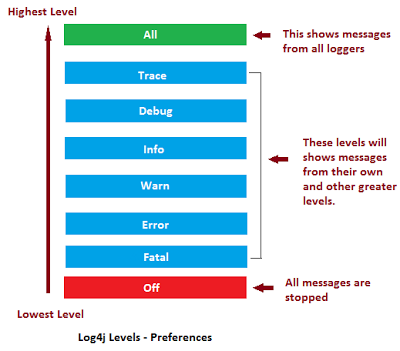

# Advanced Java

## Lambda
- Needs a functional interface
    - can ONLY HAVE 1 abstract method
    - can have any number of non abstract method

- Syntax
```java
// (arguments) -> body
(int arg0, String arg1) -> System.out.println(arg0+" and "+arg1); 
```
- Creating a functional interface:
 ```java
@FunctionalInterface
public interface FunctInterface
{
    void print(Object x);

    default void hello() {System.out.println("hello");}
}
```
- Assigning lambdas to functional interface:
```java
FunctInterface f = (Object x) -> System.out.println(x); //using lambda
FunctInterface f = System.out::println; //using method reference
```
- Calling w/ Lambdas:
```java
List<String> food = new ArrayList<>();

food.add("ramen");
food.add("burger");
food.add("steak");
food.add("sushi");

food.forEach(x->System.out.println(x)); //lambda
food.forEach(System.out::println); //method reference
```

## Logging
- You need log4j2 JAR files
    - commons-logging-1.2.jar
    - log4j-api-2.13.3.jar
    - log4j-core-2.13.3.jar
    - log4j-jcl-2.13.3.jar
- Need to create a "log4j2.properties" file

```properties
# Console logging
status = error
name = PropertiesConfig

filters = threshold

filter.threshold.type = ThresholdFilter
filter.threshold.level = all

appenders = console

appender.console.type = Console
appender.console.name = STDOUT
appender.console.layout.type = PatternLayout
appender.console.layout.pattern = %d{yyyy-MM-dd HH:mm:ss} %-5p %c{1}:%L - %m%n

rootLogger.level = debug
rootLogger.appenderRefs = stdout
rootLogger.appenderRef.stdout.ref = STDOUT
```
